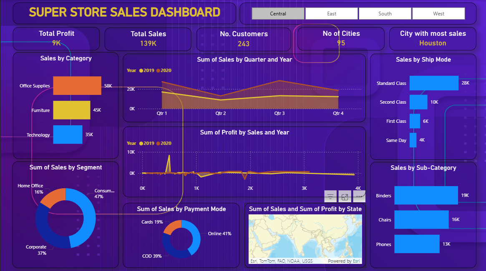

# Super Store Sales & Profitability Analytics Dashboard

## 📊 Project Overview

An interactive Power BI dashboard developed to analyze Super Store sales and profitability across different business dimensions.

The dashboard provides an overview of sales, profit, customer, product, shipping, payment, and geographic performance through interactive visualizations and filters.

## 🎯 Objectives

- Analyze overall sales and profit performance
- Compare sales across product categories
- Analyze customer segment performance
- Track quarterly and yearly sales trends
- Analyze sales by shipping mode
- Analyze payment method distribution
- Compare product sub-categories
- Explore geographic sales performance
- Identify the city with the highest sales

## 📈 Key Performance Indicators

| Metric | Value |
|---|---:|
| Total Sales | 139K |
| Total Profit | 9K |
| Number of Customers | 243 |
| Number of Cities | 95 |
| City with Most Sales | Houston |

## 🔍 Dashboard Analysis

### Sales Analysis
- Sales by Category
- Sales by Customer Segment
- Sales by Sub-Category
- Sales by Ship Mode

### Trend Analysis
- Sales by Quarter
- Sales by Year
- Profit and Sales trends

### Customer Analysis
- Customer count
- Customer segment distribution

### Geographic Analysis
- Sales by State
- City-level sales performance
- Regional filtering

### Payment Analysis
- Sales distribution by Payment Mode

## 🎛️ Interactive Filters

The dashboard includes regional filters for:

- Central
- East
- South
- West

## 🛠️ Tools & Technologies

- Power BI
- Data Analysis
- Data Visualization
- Business Intelligence

## 📷 Dashboard Preview

The dashboard provides an interactive view of Super Store sales and profitability.

## 📂 Project Files

- `dashboard/Super Store Sales Dashboard.pbix` — Power BI dashboard
- `images/super-store-dashboard.png` — Dashboard preview

## 📌 Skills Demonstrated

- Data Analysis
- Data Visualization
- Dashboard Development
- KPI Analysis
- Business Intelligence
- Sales Analysis
- Profitability Analysis
- Interactive Reporting

## 👤 Author

**Vipan Kumar**

B.Tech — Computer Science & Engineering (Artificial Intelligence)

Focused on Data Analytics, Power BI, SQL, Excel, and Python.
